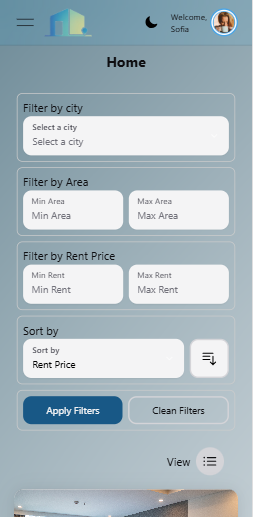

# FLAT FINDER
## Descripción
Este es el proyecto de graduación del bootcamp de Fullstack de Carlos Delgado y Alejandro Orellana.
En este proyecto buscamos resolver el problema de busqueda y publicación de departamentos de arrendamiendo.
## Lista de funcionalidades
Resgitro de usuarios
Acceso de usuarios
crear publicaciones de departamentos en disponibilidad de arrendamiento
busqueda, filtro y ordenamiento de publicaciones de departamentos en disponibilidad de arrendamiento
Añadir a publicaciones de departamentos en disponibilidad de arrendamiento como favoritos
Añadir comentarios a publicaciones de departamentos en disponibilidad de arrendamiento como favoritos
Usuarios con rol de Administrador pueden buscar, filtrar y ordenar usuarios
Usuarios con rol de Administrador pueden modificar los datos de los usuarios
Todos los usuarios pueden actualizar sus datos a excepcion de el email
Ningun usuario con cualquier rol puede actualizar la contraseña de otro usuario
## Tecnologias utilizadas
FRONT-END
- React 18.3.1
- TailwindCSS 3.4.16
- HeroUI 2.7.6
BACK-END
- Node 22.13.1
- bcrypt 5.1.1
- crypto 1.0.1
- express 4.21.2
- mongoose 8.13.2
- Json Web Token 9.0.2
DATABASE
- Mongo Atlas
## Despliegue
Clone el proyecto con el comando
git clone https://github.com/crlsdlgd/ProyectoFinalKruger.git
Para ejecutar el Back-end ingrese a la carpeta flatfinderback y encuentre el archivo .env.example
con este archivo de ejemplo cree un archivo con nombre .env y complete la información faltante
Esta información es propia para cada configuracion
Dentro de la carpeta flatfinderback abra una terminal y ejecute el comando
npm install
Para ejecutar en entorno de desarrollo ejecute
npm run start:dev
Para ejecutar en entorno de producción ejecute
npm run start
Este se ejecutara en el puerto 3000
Para ejecutar el Front-end ingrese a la carpeta flatfinderfront y abra una terminal 
para ejecutar en entorno de desarrollo ejecute:
npm run dev
para ejecutar en entorno de produccion ejecute:
npm run start
Este se ejecutara en el puerto 5173
## Uso
dirigase a http://localhost:5173/
aparecera la imagen

Ingrese sus credenciales, en caso de no tener una cuenta presione en el enlace Sing Up.
Aparecera el formulario de registro de nuevo usuario.

Ingrese todos los datos solicitados y presione en Register. Si los datos son correctos vera una notificacion en la parte superior derecha indicandole su registro exitoso y redireccionandole a Login para que pueda ingresar a la plataforma. En caso de contar con una cuenta presione en Sing In.
En la parte superior encontrara un menu con las opciones de Home, My Flats, favorites y Users (Solo si es administrador). Opciones de tema claro y oscuro, y opciones de My Profile, Update Password y Log out.

En la pagina Home encontrara todos los departamentos registrados. Puede filtrarlos por cuidad, Area o suoerficie del departamento, Precio y ordenarlos por cuidad, area y precio de forma acendente o descendente. Para aplicar los filtros presione en Apply Filter o en Clean Filters si quiere borrar todos los filtros.

Se listaran los departamentos de diez en diez. si existen mas departamentos, En la parte inferior se muestrara una barra de paginación que le permitira navegar entre paginas de departamentos.

En la pagina de my flats entontrara los Departamentos que usted ha creado, en la parte inferior derecha encontrara un boton verde con signo de + que le llevara al formulario de crear una nueva publicaion de departamento.

Si presiona en el boton de ojo en cualquier departamento, pordra ver mas detalles del departamento, añadir comentarios, ver comentarios de otros usuarios y en caso de ser usted el quien creo el departamento, puede actualizar la informacion. 

Si usted presiona en el boton con icono de corazon el corazon se mostrara completamente en rojo y se añadira a su lista de departamentos favoritos. si usted vuelve a presionar en el corazon este pasara a estar transparente y se quitara se de su lista de favoritos.

Si usted tiene el rol de Administrador, en la barra de navegacion se le mostrara la opcion de User. En esta pagina se le mostrara un listado de usuarios en los que usted puede Filtrar por edad, ordenar por nombre apellido o edad en forma acendente o descentente.

Si presiona en el boton con ojo se le mostrara mas detalles del usuario y editar sus datos o rol.

En el menu de usuario podra ver la opción de Update password, aqui usted puede actualizar su contraseña

Y por ultimo vera la opcion de Log Out que le permitira cerrar sesion. sera redirigido a la pagina de inicio de sesion.
## Licencia
- Tipo de licencia MIT
## Creditos 
- Carlos Delgado
- Alejandro Orellana

